Parse ansi strings and convert them to html and svg formats

## install
It is recommended to use npm, it will compress svg using svgo
```bash
npm i ansi2 -g
cargo binstall ansi2
cargo install ansi2 --features="cli"
```

## usage
```bash
neofetch | ansi2 > ./neofetch.svg
neofetch | ansi2 --format=svg --theme=vscode > neofetch.svg

vitest bench --run | ansi2 --format=html --mode=light > bench.html
vitest bench --run | ansi2 --format=text > bench.txt
vitest bench --run | ansi2 --format=svg --mode=dark  | resvg - -c > bench.png
cat ./assets/ghostty.png | ansi2 -f=ans
```

### cmd subcommand
Execute commands with optional shell prompt and syntax highlighting:
```bash
# Basic usage
ansi2 cmd "neofetch" --format=svg > output.svg
ansi2 cmd "ls -la" --format=html > output.html

# With shell prompt (auto-detects shell from $SHELL)
ansi2 cmd "neofetch" --prompt --format=ans > output.ans

# Specify shell explicitly (fish, bash, zsh)
ansi2 cmd "neofetch" --prompt --shell=fish --format=svg > output.svg

# Combine with other options
ansi2 cmd "ls -la" --prompt --shell=fish --theme=vscode --mode=dark > output.svg
```

The `cmd` subcommand:
- Executes the specified command and captures its output
- Optionally adds shell prompt before the command (using `--prompt`)
- Supports syntax highlighting for fish shell (via `fish_indent --ansi`)
- Auto-detects shell from `$SHELL` environment variable or use `--shell` to specify
- Combines prompt + highlighted command + command output into a single ANSI stream
- Supports all format options (svg, html, ans, text) and styling parameters

## [ansi2](./ansi2)

```rs
use ansi2::{Canvas};

let canvas = Canvas::new(s);
for row in canvas.pixels.iter() {
  for pixel in row.iter() {
      // draw pixel
  }
}
```

## [ansi2-wasm](./ansi2-wasm)
```bash
npm i ansi2 -g

neofetch | ansi2 > ./neofetch.svg
neofetch | ansi2 --format=svg --theme=vscode > neofetch.svg

```

## options
### format
```bash
neofetch | ansi2 --format=html > neofetch.html
neofetch | ansi2 --format=svg > neofetch.svg
```

### theme
vga / vscode / ubuntu
```bash
neofetch | ansi2 --format=svg --theme=vscode > neofetch.svg
```
### font
```bash
neofetch | ansi2 --format=svg --font=./font.ttf > neofetch.svg
```

### mode
dark / light
```bash
neofetch | ansi2 --format=svg --mode=dark > neofetch.svg
```

## example
### neofetch

<div align="center">
	<a href="https://github.com/ahaoboy/neofetch">
		
	</a>
</div>

### vitest
<div align="center">
	<a href="https://github.com/ahaoboy/ansi2">
		
	</a>
</div>