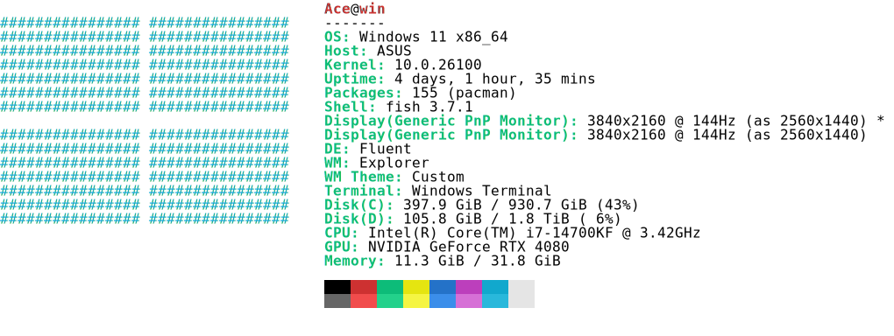
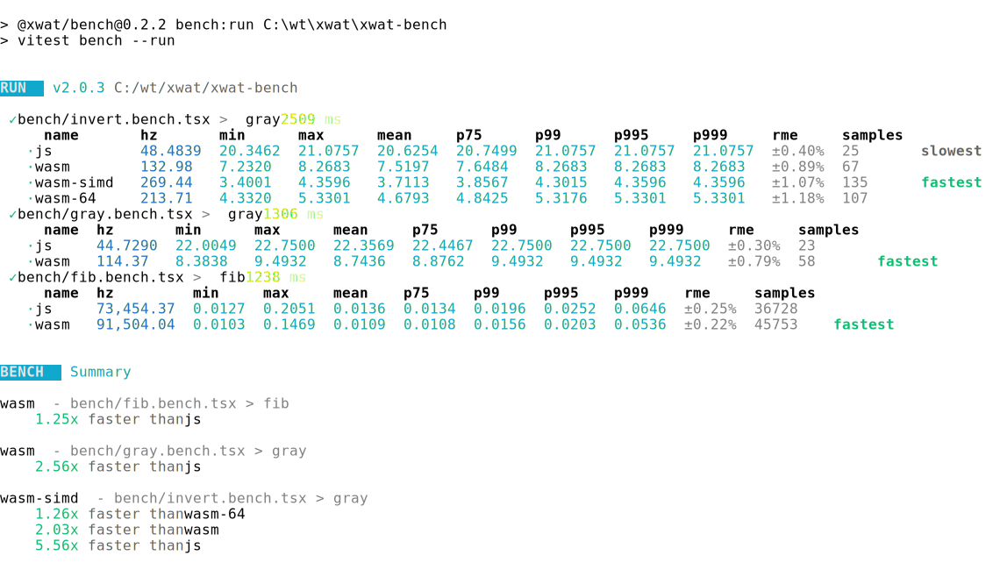

Parse ansi strings and convert them to html and svg formats

## usage

```bash
npm i ansi2 -g
cargo install ansi2
cargo binstall ansi2

neofetch | ansi2 > ./neofetch.svg
neofetch | ansi2 --format=svg --theme=vscode > neofetch.svg

vitest bench --run | ansi2 --format=html --mode=light > bench.html
vitest bench --run | ansi2 --format=text > bench.txt

vitest bench --run | ansi2 --format=svg --mode=dark  | resvg - -c > bench.png
```

## [ansi2](./ansi2)

```rs
use ansi2::{Canvas};

let canvas = Canvas::new(s);
for row in canvas.pixels.iter() {
  for pixel in row.iter() {
      // draw pixel
  }
}
```

## [ansi2-wasm](./ansi2-wasm)
```bash
npm i ansi2 -g

neofetch | ansi2 > ./neofetch.svg
neofetch | ansi2 --format=svg --theme=vscode > neofetch.svg

```

## options
### format
```bash
neofetch | ansi2 --format=html > neofetch.html
neofetch | ansi2 --format=svg > neofetch.svg
```

### theme
vga / vscode / ubuntu
```bash
neofetch | ansi2 --format=svg --theme=vscode > neofetch.svg
```
### font
```bash
neofetch | ansi2 --format=svg --font=./font.ttf > neofetch.svg
```

### mode
dark / light
```bash
neofetch | ansi2 --format=svg --mode=dark > neofetch.svg
```

## example
### neofetch

<div align="center">
	<a href="https://github.com/ahaoboy/neofetch">
		
	</a>
</div>

### vitest
<div align="center">
	<a href="https://github.com/ahaoboy/ansi2">
		
	</a>
</div>