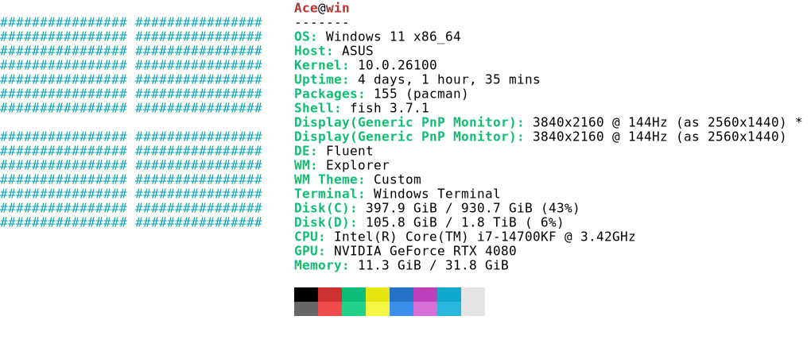

Parse ansi strings and convert them to html and svg formats

## install
It is recommended to use npm, it will compress svg using svgo
```bash
npm i ansi2 -g
cargo binstall ansi2
cargo install ansi2 --features="cli"
```

## usage
```bash
neofetch | ansi2 > ./neofetch.svg
neofetch | ansi2 --format=svg --theme=vscode > neofetch.svg

vitest bench --run | ansi2 --format=html --mode=light > bench.html
vitest bench --run | ansi2 --format=text > bench.txt
vitest bench --run | ansi2 --format=svg --mode=dark  | resvg - -c > bench.png
cat ./assets/ghostty.png | ansi2 -f=ans

# Output to file
neofetch | ansi2 -o neofetch.svg
neofetch | ansi2 --output=neofetch.html --format=html

# Output to file and open in browser
neofetch | ansi2 -o neofetch.svg --open
vitest bench --run | ansi2 -o bench.html --format=html --open
```

### cmd subcommand
Execute commands with optional shell prompt and syntax highlighting:
```bash
# Single command
ansi2 cmd -c "neofetch" --format=svg > output.svg
ansi2 cmd -c "ls -la" --format=html > output.html

# Multiple commands
ansi2 cmd -c "ls -la" -c "pwd" -c "date" --format=svg > output.svg

# With prompt and syntax highlighting
ansi2 cmd -c "echo 'Hello'" -c "ls -la" -c "pwd" --prompt --shell=fish -o output.svg

# With shell prompt (auto-detects shell from $SHELL)
ansi2 cmd -c "neofetch" --prompt --format=ans > output.ans

# Specify shell explicitly (fish, bash, zsh)
ansi2 cmd -c "neofetch" --prompt --shell=fish --format=svg > output.svg

# Combine with other options
ansi2 cmd -c "ls -la" --prompt --shell=fish --theme=vscode --mode=dark > output.svg

# Multiple commands with output to file and open in browser
ansi2 cmd -c "neofetch" -c "ls -la" --prompt -o output.svg --open
```

The `cmd` subcommand:
- Executes one or more commands and captures their output
- Use `-c` or `--command` flag (required, can be specified multiple times)
- Optionally adds shell prompt before each command (using `--prompt`)
- Supports syntax highlighting for fish shell (via `fish_indent --ansi`)
- Auto-detects shell from `$SHELL` environment variable or use `--shell` to specify
- For multiple commands: executes each with prompt → syntax highlighting → command output
- Combines all outputs into a single ANSI stream
- Supports all format options (svg, html, ans, text) and styling parameters


```bash
ansi2 cmd -c "neofetch" > neofetch-cmd.svg
```
<div align="center">
  <a href="https://github.com/ahaoboy/ansi2">
    
  </a>
</div>

## [ansi2](./ansi2)

```rs
use ansi2::{Canvas};

let canvas = Canvas::new(s);
for row in canvas.pixels.iter() {
  for pixel in row.iter() {
      // draw pixel
  }
}
```

## [ansi2-wasm](./ansi2-wasm)
```bash
npm i ansi2 -g

neofetch | ansi2 > ./neofetch.svg
neofetch | ansi2 --format=svg --theme=vscode > neofetch.svg

```

## options
### format
```bash
neofetch | ansi2 --format=html > neofetch.html
neofetch | ansi2 --format=svg > neofetch.svg
```

### theme
vga / vscode / ubuntu
```bash
neofetch | ansi2 --format=svg --theme=vscode > neofetch.svg
```
### font

Note: resvg does not support font-face, so the converted png may be different from svg
```bash
neofetch | ansi2 --format=svg --font=./font.ttf > neofetch.svg
neofetch | ansi2 --format=svg --font=Consolas > neofetch.svg
neofetch | ansi2 --format=svg --font="Courier New" > neofetch.svg
neofetch | ansi2 --format=svg --font="Monaco" > neofetch.svg
neofetch | ansi2 --format=svg --font=https://fonts.cdnfonts.com/s/98875/JetBrainsMonoRegular.woff > neofetch.svg
neofetch | ansi2 --format=svg --font=https://fonts.cdnfonts.com/s/55487/FiraCode-Regular.woff > neofetch.svg
```

### font-size

```bash
neofetch | ansi2 --format=svg --font-size=32 > neofetch.svg
```

### mode
dark / light
```bash
neofetch | ansi2 --format=svg --mode=dark > neofetch.svg
```


### width

Set the terminal width, the default value is 0, which means unlimited width

```bash
neofetch | ansi2 --width=100 > neofetch.svg
```


### light-bg and dark-bg

Set the background color for dark and light modes. The default for light mode is ```#FFFFFF```, and the default for dark mode is ```#181818```

```bash
neofetch | ansi2 --format=svg --light-bg=#FFFFFF --dark-bg=#181818 > neofetch.svg
```

### compress

Compressing using [oxvg](https://github.com/noahbald/oxvg.git), this maybe will increase the running time by several seconds, but can save half of the storage space.

```bash
neofetch | ansi2 --format=svg --compress > neofetch.svg
neofetch | ansi2 --format=svg -c > neofetch.svg
```


### length-adjust

https://developer.mozilla.org/en-US/docs/Web/SVG/Attribute/lengthAdjust

The textLength attribute is added by default and can be removed using an empty string


```bash
neofetch | ansi2 --format=svg --length-adjust=spacing > neofetch.svg
neofetch | ansi2 --format=svg --length-adjust=spacingAndGlyphs > neofetch.svg
neofetch | ansi2 --format=svg --length-adjust="" > neofetch.svg
```

### sourcemap


Add data to the class field of the corresponding pixel in the html/svg file

```text:10:20``` means the text comes from characters 10 to 20 of the ans file


```bash
neofetch | ansi2 --format=svg -s > neofetch.svg
```

### output

Write output to a file instead of stdout

```bash
neofetch | ansi2 -o neofetch.svg
neofetch | ansi2 --output=neofetch.html --format=html
```

### open

Open the output file in the default browser (requires `-o` or `--output`)

```bash
neofetch | ansi2 -o neofetch.svg --open
vitest bench --run | ansi2 -o bench.html --format=html --open
ansi2 cmd -c "ls -la" -o output.svg --open
```


## example
### neofetch

<div align="center">
  <a href="https://github.com/ahaoboy/neofetch">
    
  </a>
</div>

### vitest

```bash
vitest bench --run | ansi2 > bench.svg
```
<div align="center">
  <a href="https://github.com/ahaoboy/ansi2">
    
  </a>
</div>


### 16colo

[16colo](https://16colo.rs/) is an online archive for ANSI and ASCII artpacks.

```bash
cat take-my-ansi.utf8.ans | ansi2 > take-my-ansi.svg
```

<div align="center">
  <a href="https://github.com/ahaoboy/ansi2">
    
  </a>
</div>

### nushell

```bash
ls | table | ansi2 | save nu-ls.svg -f
```
<div align="center">
  <a href="https://github.com/ahaoboy/ansi2">
    
  </a>
</div>

length-adjust can make the text look better

```bash
ls | table | ansi2 --length-adjust=spacingAndGlyphs | save nu-ls.svg -f
```
<div align="center">
  <a href="https://github.com/ahaoboy/ansi2">
    
  </a>
</div>

## changelog

- [0.2.12](./assets/changelog/0.2.12.md)

## todo

- [x] link
- [x] merge characters of the same style to reduce the number of tags
- [x] vscode extension: [preview-easy](https://github.com/ahaoboy/preview-easy.git)
- [ ] ansi minify
- [ ] html support copy text, continuous text will be separated by line breaks
- [x] html minify